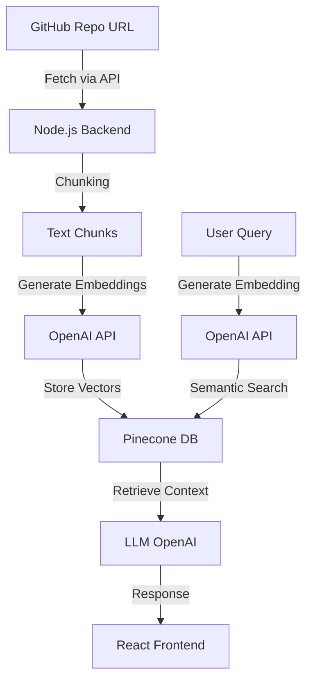

# RepoMindAI 🚀


AI-powered GitHub repository assistant that lets users chat with any GitHub repo using RAG, embeddings, and vector search.

## 📸 Demo

Add screenshots or GIF here.

## ✨ Features

- Chat with any GitHub repository
- AI-powered code understanding
- Semantic search using embeddings
- Pinecone vector database
- Fast and modern UI
- Repository-specific context retrieval

## 🛠 Tech Stack

- React.js
- Node.js
- Express.js
- OpenAI API
- Pinecone
- GitHub API

## 💡 Why RepoMindAI?

RepoMindAI bridges the gap between massive codebases and developer comprehension. It allows developers to onboard instantly, understand architecture, find specific implementations, and debug efficiently by simply chatting with the repository.

## 🏗 Architecture Diagram



## ⚙️ How It Works

1. Enter GitHub repository URL
2. Repo files are fetched using GitHub API
3. Files are chunked and converted into embeddings
4. Embeddings stored in Pinecone
5. Ask questions about the repository
6. AI returns contextual answers

## 📡 API Endpoints

- `POST /api/index-repo` - Indexes a GitHub repository
- `POST /api/chat` - Sends a query to the AI and gets a response

## 🚀 Installation

```bash
git clone https://github.com/pratham9805/repoMindAI.git

cd client
npm install

cd ../server
npm install
```

## 🔑 Environment Variables

```env
OPENAI_API_KEY=
PINECONE_API_KEY=
GITHUB_TOKEN=
```

## ▶️ Run Project

```bash
# frontend
cd client
npm run dev

# backend
cd ../server
npm start
```

## 👨‍💻 Author

Pratham Patel
